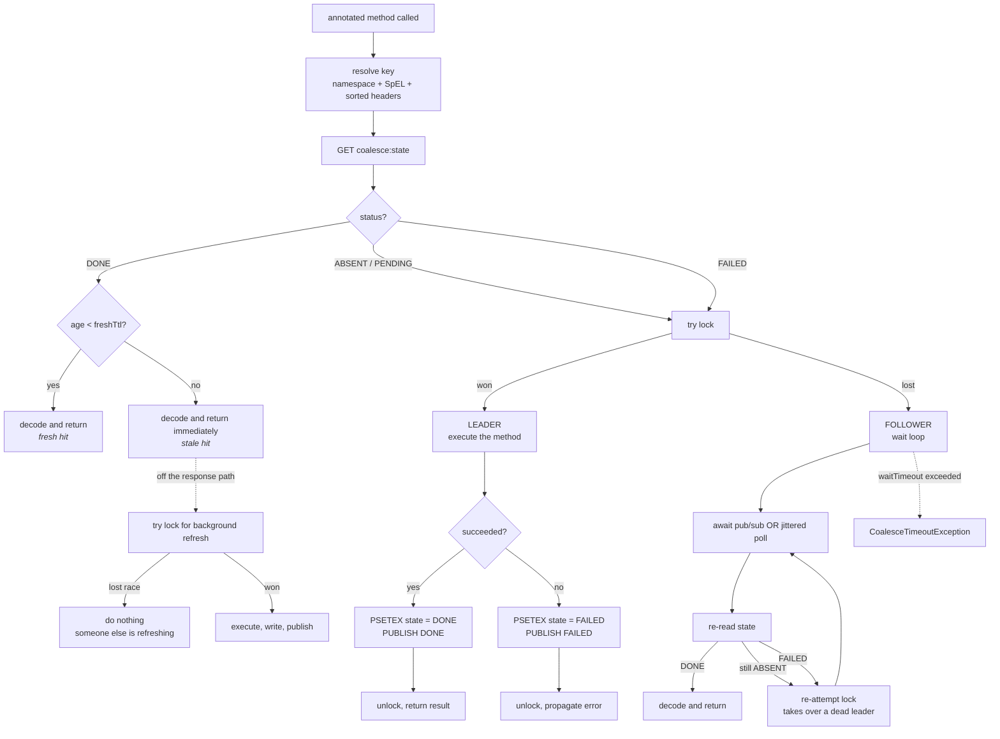
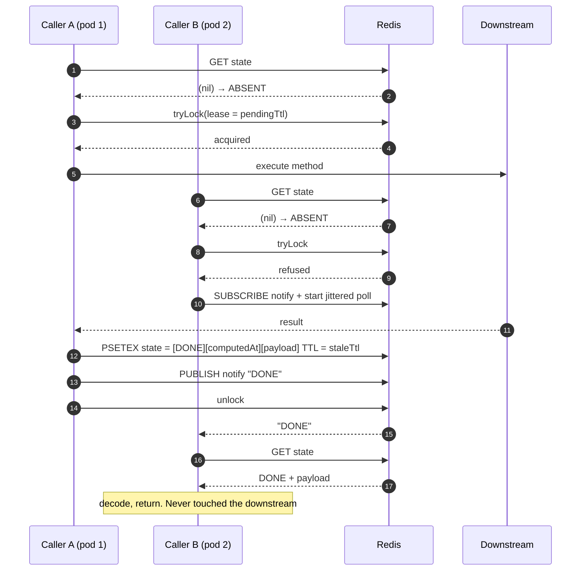
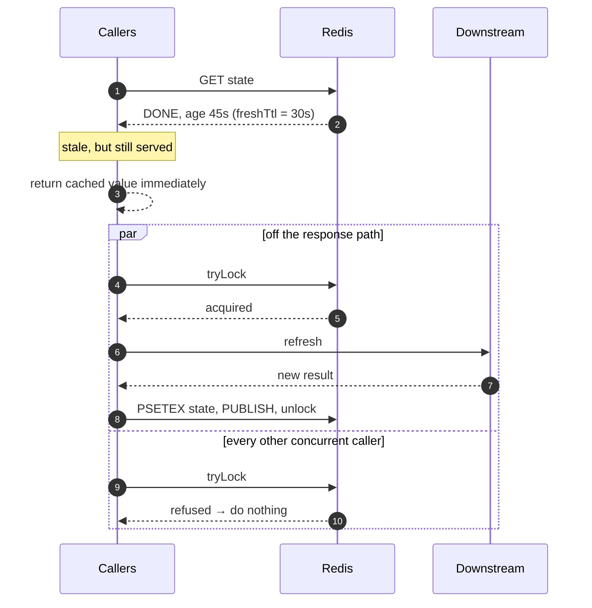
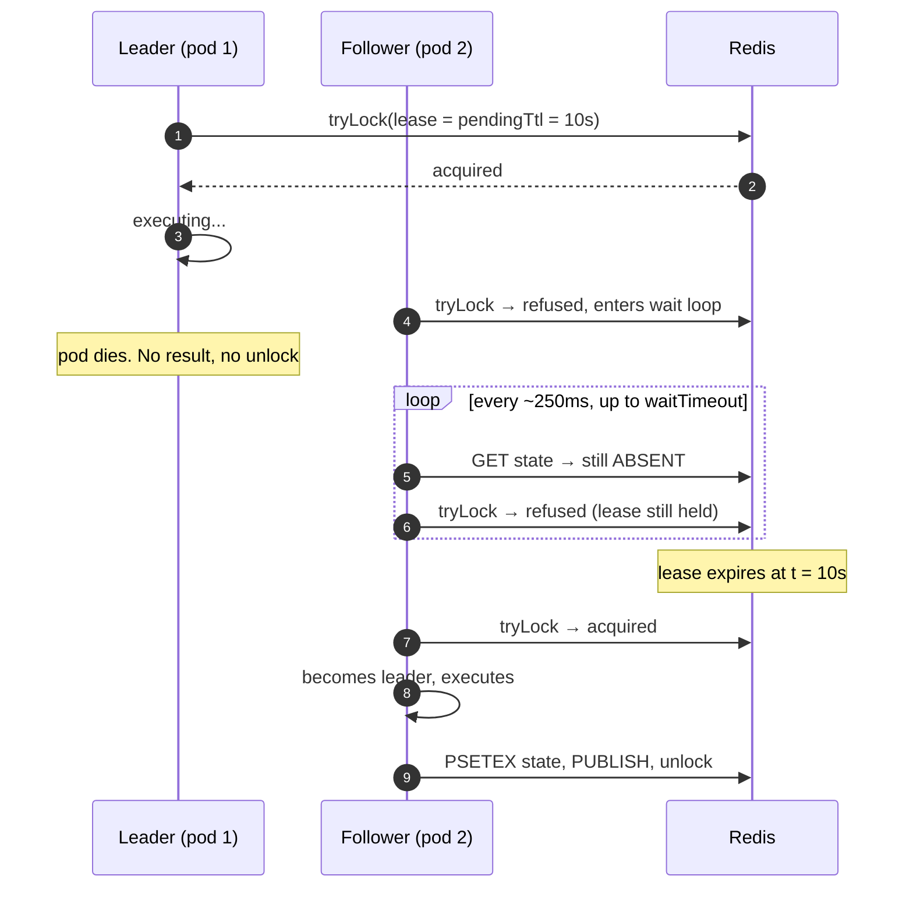
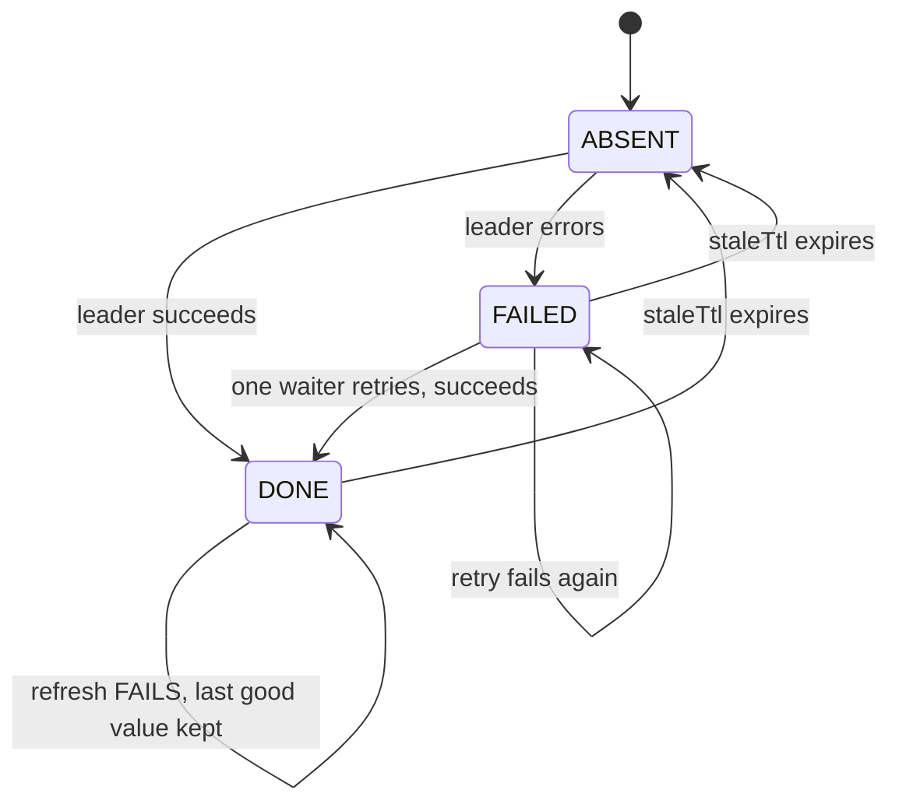

# `@Coalesce`

[](https://github.com/BitanSarkar/coalesce-java/actions/workflows/ci.yml)
[](https://central.sonatype.com/artifact/net.bitsar/coalesce-spring-boot-starter)
[](LICENSE)


Distributed reactive call coalescing with stale-while-revalidate, for Spring WebFlux.

Put `@Coalesce` on a `Mono`- or `Flux`-returning method and three things happen:

1. Concurrent callers share one execution. If the same logical call is already in flight
   anywhere in the cluster, later callers wait for it and reuse the result rather than
   re-executing.
2. The result is cached for a configurable window, acting as a TPS shield in front of a
   slow or expensive dependency.
3. Stale data is refreshed in the background. Callers get an instant response from the
   last known-good value while at most one call refreshes it.

It is global-only: there is no per-pod in-memory tier. All coordination state lives in
Redis via Redisson, so every pod is stateless with respect to coalescing and
interchangeable at any time.

```java
@Coalesce(
        key = "#orderId",
        headerKeys = {"X-Tenant-Id"},
        freshTtlSeconds = "${orders.fresh-ttl:30}",   // or just "30"
        staleTtlSeconds = "300",
        pendingTtlSeconds = "20",
        waitTimeoutSeconds = "25")
public Mono<OrderDto> getOrder(String orderId) {
    return orderClient.fetch(orderId);
}
```

---

## Contents

- [Installation](#installation)
- [Quick start](#quick-start)
- [When to use it](#when-to-use-it), and the arithmetic that decides
- [When not to use it](#when-not-to-use-it)
- [How it works](#how-it-works): flow diagrams
- [The four TTL parameters](#the-four-ttl-parameters)
- [Configuration reference](#configuration-reference)
- [Metrics and what to watch](#metrics-and-what-to-watch)
- [Operational hazards](#operational-hazards)
- [Benchmarking](#benchmarking)
- [Limitations and non-goals](#limitations-and-non-goals)
- [Repository layout](#repository-layout)

---

## Installation

Gradle:

```groovy
implementation 'net.bitsar:coalesce-spring-boot-starter:0.2.3'
```

Maven:

```xml
<dependency>
    <groupId>net.bitsar</groupId>
    <artifactId>coalesce-spring-boot-starter</artifactId>
    <version>0.2.3</version>
</dependency>
```

Requires Java 17 and Spring Boot 3.2+. Everything wires itself through auto-configuration.
There is nothing to `@Import` and no package to add to your component scan. Point it at a
Redis and annotate a method:

```yaml
coalesce:
  redis:
    address: redis://localhost:6379
```

**One build setting is not optional.** `key = "#orderId"` is SpEL over parameter *names*,
and since Spring 6 those are read only from the `-parameters` compiler flag. Spring Boot's
Gradle and Maven plugins set it for you; a build that does not use them must add it, or the
key expression silently evaluates to `null`:

```groovy
tasks.withType(JavaCompile).configureEach {
    options.compilerArgs << '-parameters'
}
```

### Bring your own Redis client

The starter builds a single-server `RedissonClient` from `coalesce.redis.*` only when the
application has not declared one. Declare a `RedissonClient` or `RedissonReactiveClient`
bean (from the Redisson Spring Boot starter, or by hand for cluster, sentinel or
replicated topologies) and it is used unchanged. For Redis Cluster this is the only
supported path, and `ReadMode.MASTER` is required: a stale read off a replica can show a
follower a `FAILED` state for work that has already succeeded, and it will re-execute it.

Every other piece backs off the same way. Declare your own `CoalesceCodec`,
`CoalesceCoordinator`, `CoalesceKeyResolver` or `CoalesceMetrics` bean and the
auto-configuration leaves that one alone.

---

## Quick start

The `coalesce-demo` module is an A/B load harness for the starter. It needs Java 17 and a
Redis on `localhost:6379`.

```bash
./gradlew :coalesce-demo:bootRun
```

```bash
curl "http://localhost:8080/api/orders/3?coalesce=true"
```

Swagger UI is at `http://localhost:8080/swagger-ui.html`, and the A/B counters at
`GET /api/stats`.

---

## When to use it

### The one number that decides

The benefit is governed entirely by **how many requests arrive for the same key inside one
refresh window**:

```
window   = freshTtlSeconds + downstream_latency
ratio    = requests_per_second_per_key × window
saving  ≈ 1 − 1 / ratio          (for ratio ≥ 1; below 1 there is nothing to share)
```

The window includes downstream latency because a key cannot go fresh again until the
refresh actually lands.

This model has been checked against three real load tests on this repo's demo endpoint,
and predicts each within a third of a percentage point:

| distinct keys | req/s per key | window | ratio | predicted | **measured** |
|---|---|---|---|---|---|
| 10 | 12.35 | 2.3s | 28.4 | 96.5% | **96.48%** |
| ~95 | 0.26 | 4.2s | 1.10 | 8.8% | **8.78%** |
| ~1,000,000 | 0.000018 | 122.4s | 0.002 | ~0% | **0.25%** |

Screening rule:

| ratio | verdict |
|---|---|
| **< 2** | net loss: you add Redis round trips to save nothing |
| **2 to 5** | marginal; only worth it if the downstream is genuinely expensive |
| **> 10** | strong |

**Key cardinality, not traffic volume, is the deciding variable.** In the runs above the
request rate barely changed; widening the key space from 10 to ~1,000,000 took the saving
from 96% to nothing.

### Good fits

- Third-party APIs with rate limits or per-call billing. 28× fewer calls is money, and
  quota exhaustion is a real outage.
- Shared reference data: config, feature flags, catalogs, pricing tables, FX rates.
- Auth token fetches. A client-credentials token is one key shared by every request in the
  fleet; a textbook fit.
- Expensive aggregations whose inputs change more slowly than they are read: dashboards,
  leaderboards, "top N".
- Slow, capacity-constrained backends: mainframe, legacy SOAP, a database that cannot be
  scaled further.
- Thundering-herd shapes: a hot item during a spike, or a cold cache after a deploy.

### Two different benefits, two different drivers

Worth separating, because a run can deliver one and not the other:

| | saves an execution | serves instantly |
|---|---|---|
| **fresh hit** (age < `freshTtl`) | yes | yes |
| **stale hit** (age ≥ `freshTtl`) | no: triggers a refresh | yes |
| **follower wait** | yes | no: waits for the leader |

A measured run with 7,665 cache hits produced only ~949 saved executions, because 6,716 of
those hits were *stale*: instant for the caller, but each one still triggered a refresh.
That run showed a 2.2× latency improvement alongside only a 1.1× load reduction. If your
goal is downstream load, watch `freshTtl`. If it is latency, stale hits are enough.

---

## When not to use it

**Non-idempotent operations.** Redis failover has an inherent window where two pods can
both believe they hold the lock. Never use this to protect payments, order placement, or
any side-effecting write without independent idempotency at the data layer.

**Per-user or per-request keys.** If key cardinality approaches request count, the ratio
collapses below 1 and every request pays for a mechanism that shares nothing. This is the
most likely way to misuse the framework.

**Already-fast operations.** The cold path costs six sequential Redis round trips: five
for coalescing, plus one to read the kill switch. Saving a 5ms indexed lookup is a wash
at best. In the worst measured run the overhead was +33ms mean, invisible against a 2.4s
downstream, but it would be several times the total response time of a 5ms endpoint. The
endpoints where the overhead is most visible are exactly the ones where the benefit is
smallest.

**Reads with hidden side effects:** audit logging, quota decrement, session touch,
"last viewed" tracking. Coalescing collapses those too, silently.

**Authorization-scoped data.** If the key does not include the tenant or principal, you
will serve one tenant's data to another out of cache. That is a breach, not a bug. Make
"does the key include the security principal?" a hard review rule. `headerKeys` exists for
this.

**Freshness-critical reads:** balance before a transfer, inventory at checkout,
permission decisions. `staleTtlSeconds` is a promise to the business, not a tuning knob.

### What the anti-pattern looks like in production

A real run against ~1,000,000 distinct keys:

```
                      requests   executions   saved    mean latency
without coalescing      10,641       10,641       0         2,394ms
with coalescing         10,640       10,613      27         2,427ms

framework: cacheHits=47  followerWaits=0  leaderExecutions=10,613
```

Every percentile regressed (P95 4,450 → 4,475ms; P99 5,070 → 5,160ms). `followerWaits: 0`
means not one request in ten thousand ever coalesced. The 47 hits were random key
collisions. Five Redis round trips, ten thousand times, to save twenty-seven executions.
That run predates the kill switch, which makes it six today.

**`(cacheHits + followerWaits) / requests` near zero means the framework is pure overhead
on that endpoint.** That is the canary.

---

## How it works

### The three Redis objects

One deterministic key string names three separate Redis keys that share a hash tag:

| role | key | type | purpose |
|---|---|---|---|
| lock | `coalesce:lock:{ns:key}` | Redisson lock (hash) | leader election |
| state | `coalesce:state:{ns:key}` | bucket (bytes) | cached status + payload |
| notify | `coalesce:notify:{ns:key}` | pub/sub topic | wake-up for waiting followers |

They **must** be three distinct Redis keys. A lock stores a hash and the bucket stores a
plain value, so sharing one key makes the bucket write clobber the lock and every later
lock operation fail with `WRONGTYPE`.

They **must** share one `{...}` hash tag, placed before the role infix, so Redis Cluster
routes all three to the same slot. Apply hash tags from the first deployment; retrofitting
them invalidates every key in flight.

### Request flow



The critical rule: **every call reads the bucket before it ever touches the lock.** A
caller arriving just after the leader released the lock must find the cached result sitting
next to it, not re-execute from scratch.

### Cold start with followers



The poll is a jittered 200 to 320ms safety net. Pub/sub is fire-and-forget, so a dropped
notification must not strand a follower; the poll alone is sufficient to make progress.

### Stale-while-revalidate



Concurrent stale readers all get an instant response, and exactly one refresh runs. If a
background refresh fails, the previous value is deliberately left in place, which is why
`staleTtlSeconds` doubles as your ride-through window for a downstream outage.

### Crash recovery



Recovery depends on waiters re-attempting the lock, not merely re-reading the bucket. It
therefore requires `waitTimeoutSeconds` > `pendingTtlSeconds`. Otherwise every waiter has
given up before the dead leader's lease expires and the crash surfaces as a wave of
errors. Measured recovery with `pendingTtl = 3s`: one takeover at 2.96s, zero timeouts.

### Bucket state machine



`FAILED` frees the lock immediately for exactly one retry. There is deliberately no
backoff: retry policy and circuit breaking are a separate concern that belongs in a layer
around the annotated method, not inside a coalescing framework.

### Key derivation

```
coalesce:{Namespace:spelResult:HeaderA=x|HeaderB=y}
          └──────────── one hash tag ────────────┘
```

Nothing makes a key "globally unique" on its own. One Redis stands behind every pod, so
any string all pods agree on already names the same entry. The whole engineering problem is
making every pod compute the byte-identical string for the same logical call:

- Never derive a key from `toString()`/`hashCode()` of a DTO. It is identity-based and
  differs per instance. Reference explicit fields via SpEL.
- `headerKeys` is sorted internally, so declaration order cannot change the key. Values are
  trimmed.
- If hashing a whole payload, serialize it canonically first: two JSON encodings of the
  same object with different property order hash differently.
- Namespace defaults to the method's full signature,
  `com.acme.OrderService.getOrder(String)`. The shorter `ClassSimpleName.methodName` would
  not be unique: overloads share a method name, and two classes in different packages share
  a simple name, so either shape would put two different results in one Redis entry. The
  package and parameter types make it unique by construction, so overloads work with no
  annotation changes. Set `namespace` explicitly to shorten it. Two methods sharing an
  explicit namespace is left alone, since that is someone choosing to share an entry.

### Envelope format

The bucket holds an explicit envelope, not a bare payload:

```
byte  0      status      0 = DONE, 1 = FAILED
bytes 1..8   computedAt  epoch millis, big-endian
bytes 9..    payload     encoded result, or UTF-8 error message
```

Two reasons this is not a string prefix. A real payload can legitimately begin with the
bytes `FAILED:`, and, more subtly, the age comparison behind stale-while-revalidate needs
the time the value was *written*. Stamping `computedAt` at read time makes every cached
value look freshly computed, and background refresh never fires at all.

### Redis round trips per path

| path | round trips | notes |
|---|---|---|
| fresh or stale cache hit | **1** | a single `GET`; the refresh is off the response path |
| cold start (leader) | **5** | `GET` → `tryLock` → `PSETEX` → `PUBLISH` → `unlock` |
| follower | 2 + one per poll | `GET`, failed `tryLock`, then poll until woken |

The hit path being one round trip is why this pays off on a warm key, and the five-trip
cold path is why it is a bad deal when every key is unique.

**Every path costs one more than the table says**, because the runtime kill switch is read
through on each invocation, so a cache hit is really two round trips. The figures above are
the coalescing path's own cost. See
[Turning it off at runtime](#turning-it-off-at-runtime) for why the switch is read rather
than cached, and what would remove the cost.

---

## The four TTL parameters

All four are independent clocks, and only one is an actual Redis TTL:

| parameter | what it physically is | measured from |
|---|---|---|
| `freshTtlSeconds` | an age comparison; nothing expires | `computedAt` in the envelope |
| `staleTtlSeconds` | the **Redis TTL** on the bucket | write time |
| `pendingTtlSeconds` | the **lock lease** | lock acquisition |
| `waitTimeoutSeconds` | a Reactor timeout on the follower | the follower's arrival |

### Timeline for one key

```
t=0          leader wins lock, lease = pendingTtl, starts executing
             other callers arrive → wait, giving up at waitTimeout
t=E          execution done. bucket written, TTL = staleTtl, computedAt = E.
             DONE published, lock released.

E → E+fresh          cache hit, served instantly, NOTHING else happens
E+fresh → E+stale    cache hit, served instantly, ONE background refresh fires
after E+stale        key gone. next caller executes cold and waits for it.
```

Both the fresh and stale clocks start when the value **lands**, not when execution started.

### `freshTtlSeconds`: "how stale can this be before I go get a new one?"

Not a correctness bound; it is the load knob. Below it you save an execution; above it
you still serve instantly but pay for a refresh. Shortening it buys freshness at a linear
cost in downstream load.

Set it well above the downstream's p99, not near it. At `freshTtl = 2s` against a 2.2s
call, a value is stale almost as soon as it lands. A measured run in that configuration
achieved only 8.78% load reduction while issuing 6,716 background refreshes.

- `0` → refresh on every read after the first write.
- equal to `staleTtlSeconds` → stale-while-revalidate is effectively disabled; a plain
  cache that expires and forces a cold execution.

### `staleTtlSeconds`: "if the downstream is down, how long do I keep serving?"

This is a resilience decision more than a caching one. Refresh failures deliberately leave
the previous value in place, so `staleTtl` is literally your outage ride-through window.
When it expires you go from "slightly old data" to "every caller gets an error."

It is simultaneously the hard correctness bound (the oldest data any caller can ever
receive) and your Redis memory bill: `keys × payload × staleTtl`.

### `pendingTtlSeconds`: "what is the longest this call could legitimately take?"

p99 plus margin, never p50.

It does **not** cancel a slow leader. The leader keeps running; the lock merely becomes
claimable. So setting it too low does not stop anything. It lets a second leader start
alongside the first, doubling load on a downstream already slow enough to have tripped it.

Because the lease is passed explicitly, Redisson's watchdog does not renew it. People
often assume Redisson keeps a held lock alive automatically; that only happens when you
acquire without a lease. Here `pendingTtl` is a hard ceiling, which is exactly what makes
crash recovery work.

### `waitTimeoutSeconds`: "how long will my caller tolerate waiting?"

Should sit just under whatever timeout your client, gateway or ingress enforces. Beyond
that you are holding connections for requests nobody is listening to. Exceeding it raises
`CoalesceTimeoutException`.

### Relationships that matter

```
freshTtl  ≤  staleTtl
p99(exec) <  pendingTtl  <  waitTimeout          ← crash recovery needs this
waitTimeout  ≤  client/gateway timeout
```

For a crash to be fully invisible you want `waitTimeout > pendingTtl + p99(exec)`.

### Getting them wrong

| | too low | too high |
|---|---|---|
| `freshTtl` | constant background refresh; load reduction collapses | serving stale data nobody refreshes |
| `staleTtl` | cold misses, no fallback during an outage | very old data; Redis memory |
| `pendingTtl` | duplicate leaders pile onto an already-slow downstream | slower takeover after a real crash |
| `waitTimeout` | timeouts while a healthy leader is still working; **crash recovery silently stops working** | connections held for abandoned requests |

---

## Configuration reference

### Annotation

| attribute | default | meaning |
|---|---|---|
| `key` | *required* | SpEL over the method's parameters, e.g. `"#orderId"` |
| `headerKeys` | `{}` | header names folded into the key; sorted internally |
| `namespace` | `Class.method` | logical namespace prefix |
| `freshTtlSeconds` | `"0"` | age below which no refresh is triggered |
| `staleTtlSeconds` | `"60"` | Redis TTL; outer bound on usable staleness |
| `pendingTtlSeconds` | `"30"` | lock lease, the crash-recovery safety net |
| `waitTimeoutSeconds` | `"45"` | follower's hard cap before `CoalesceTimeoutException` |

### Configuring the annotation from properties or the environment

Every attribute accepts a property placeholder, so TTLs do not have to be frozen at compile
time:

```java
@Coalesce(
        key = "#orderId",
        freshTtlSeconds = "${orders.fresh-ttl:30}",
        staleTtlSeconds = "${orders.stale-ttl:300}",
        headerKeys = "${orders.headers:X-Tenant-Id}")
public Mono<OrderDto> getOrder(String orderId) { ... }
```

Anything Spring's `Environment` can resolve works, which includes environment variables
through relaxed binding: `ORDERS_FRESH_TTL=5` satisfies `${orders.fresh-ttl}`. So the same
image can run with a 5-second TTL in staging and 300 in production.

- Always give a placeholder a default (the `:30` above) unless the property is genuinely
  required. Attributes resolve on first invocation, not at startup, so a missing property
  fails a request rather than failing to boot.
- Resolution is cached per method. Placeholders cost nothing per call, and a property
  changed at runtime is not picked up.
- A resolved `headerKeys` value is split on commas, so one property can supply the whole
  list: `${orders.headers:X-Tenant-Id,X-Region}`. Otherwise the list length would be fixed
  at compile time, which defeats the point.

The numeric attributes are declared as `String` for the same reason `@Scheduled` has
`fixedDelayString`: Java requires annotation values to be compile-time constants, so
`freshTtlSeconds = ${...}` cannot typecheck as a `long`. Literals still work (`"30"` is
read as 30) and a value that does not parse fails with the method name and the raw
attribute in the message.

### Properties

```yaml
coalesce:
  enabled: true                 # false disables the aspect entirely; nothing touches Redis
  active: true                  # starting position of the runtime kill switch, see below
  # Results larger than this are returned to the caller but never written to Redis.
  max-payload-bytes: 1048576
  redis:
    enabled: true               # false to require your own RedissonClient bean
    mode: single                # single | cluster
    username: ""                # ACL-enabled servers
    password: ""
    timeout: 3s                 # command response deadline
    connect-timeout: 10s
```

**`mode: single`**

```yaml
coalesce:
  redis:
    address: redis://localhost:6379    # rediss:// for TLS
    database: 0
    connection-pool-size: 64
    connection-minimum-idle-size: 10
```

**`mode: cluster`**: seed nodes only; Redisson discovers the rest of the topology.

```yaml
coalesce:
  redis:
    mode: cluster
    nodes:
      - redis://node1:6379
      - redis://node2:6379
      - redis://node3:6379
    read-mode: MASTER           # leave this alone, see below
    scan-interval: 5s
    master-connection-pool-size: 64
    master-connection-minimum-idle-size: 10
    slave-connection-pool-size: 64
    slave-connection-minimum-idle-size: 10
```

`database` is ignored in cluster mode (Redis Cluster only has database 0) and setting it
logs a warning.

> **`read-mode` is a correctness setting, not a performance one.** Replication is
> asynchronous, so a replica read can show a follower a stale `FAILED`, or a stale absence,
> for work the leader has *already completed*, and that follower will re-execute it. The
> library warns loudly if you set anything but `MASTER`, but it honours your choice.

**TLS** applies to either mode.

```yaml
coalesce:
  redis:
    ssl:
      enabled: true             # rewrites redis:// addresses to rediss://
      truststore: classpath:redis-truststore.jks
      truststore-password: ${REDIS_TRUSTSTORE_PASSWORD}
      keystore: file:/etc/certs/client.p12      # mutual TLS only
      keystore-password: ${REDIS_KEYSTORE_PASSWORD}
      keystore-type: PKCS12
      verification-mode: STRICT # STRICT | CA_ONLY | NONE
      protocols: [TLSv1.3]
      ciphers: []
      provider: JDK             # OPENSSL needs a netty-tcnative jar on the classpath
```

`truststore` and `keystore` are Spring resources, so `classpath:`, `file:` and bare paths
all work. Leave them unset to use the JVM's own truststore, which is usually right for a
managed Redis with a publicly-trusted certificate.

`enabled: true` exists because Redisson decides whether a connection is encrypted from the
address scheme alone: configuring a truststore against a `redis://` address connects in
plaintext while looking fully configured for TLS. Setting it rewrites the scheme so the two
cannot disagree; addresses already written as `rediss://` are encrypted either way.

`verification-mode: CA_ONLY` skips the hostname check, which is what a managed Redis
addressed by IP usually needs. `NONE` disables verification entirely and makes the
connection trivially interceptable.

Anything else (sentinel, replicated, master-slave, or tuning these properties do not
reach) is configured by declaring your own `RedissonClient` or `RedissonReactiveClient`
bean. Every `coalesce.redis.*` key is ignored when you do.

The starter ships `spring-configuration-metadata.json`, so all of these get completion and
inline documentation in an IDE.

### Turning it off at runtime

`coalesce.enabled: false` removes the beans at startup. That is the wrong tool during an
incident, because it needs a deploy, and a coalescing layer sits in front of a dependency
precisely when that dependency is in trouble.

`CoalesceToggle` is a switch on beans that already exist. Turning it off makes annotated
methods behave as if the annotation were not there: the aspect calls straight through and
nothing touches Redis, not even to read. It takes effect on the next invocation.

```java
@Autowired CoalesceToggle toggle;

toggle.setActive(false).subscribe();   // everything, the big red button
```

Usually one dependency is sick and the rest are fine, and switching the whole application
off would strip the shield from every healthy downstream still being protected. Scope it to
one method instead:

```java
toggle.setActive("com.acme.OrderService.getOrder(String)", false).subscribe();
toggle.clearOverride("com.acme.OrderService.getOrder(String)").subscribe();
```

The namespace is the same string that names the method's Redis entries: the `namespace`
attribute when set, otherwise the method's full signature. Both calls return the position
they replaced.

**The switch lives in Redis, not in a field.** A pod-local switch would only affect the one
pod the load balancer happened to route the request to, leaving every other pod coalescing
while the operator believed otherwise. Every pod reads the same state, so one call moves
the fleet, and every operation is reactive because reading it is a Redis call.

The cost is a round trip: the switch is read through on every annotated invocation, so a
cache hit is **two** round trips rather than one. That buys agreement across pods with no
propagation delay and nothing to reconcile. Caching it locally and invalidating over
pub/sub would remove the cost, and `CoalesceToggle` is an interface so that implementation
drops in without the aspect changing.

Nothing is written at startup, so pods cannot race to seed it: an unset switch falls back
to `coalesce.active`, and a namespace with no override of its own follows the global
switch. If Redis cannot be read the switch reports active, which keeps a Redis outage
behaving exactly as it did before the switch existed. The corollary is that the switch
itself is not reliably reachable during an outage.

The global switch wins: while it is off everything is bypassed regardless of any override,
so the big red button cannot be undermined by a stale per-method setting.

`coalesce.active` sets where it starts, and defaults to true. Declare your own
`CoalesceToggle` bean to start it from somewhere else, such as a feature-flag service.

With Actuator on the classpath there is an endpoint, which has to be exposed before it
appears:

```yaml
management:
  endpoints:
    web:
      exposure:
        include: coalesce
```

```bash
curl localhost:8080/actuator/coalesce
# {"active":true,"overrides":{},"leaderExecutions":41,"cacheHits":1180, ...}

# everything
curl -X POST localhost:8080/actuator/coalesce \
     -H 'Content-Type: application/json' -d '{"active": false}'

# one namespace
curl -X POST localhost:8080/actuator/coalesce \
     -H 'Content-Type: application/json' \
     -d '{"namespace": "OrderService.getOrder", "active": false}'

# drop the override again
curl -X POST localhost:8080/actuator/coalesce \
     -H 'Content-Type: application/json' \
     -d '{"namespace": "OrderService.getOrder", "active": null}'
```

The counters come back alongside the switch because the question anyone flipping it
actually has is whether coalescing is helping, which
`(cacheHits + followerWaits) / requests` answers and the switch position does not. This is
a write endpoint that disables a production safeguard, so secure it as one.

A method whose TTLs do not validate can still be bypassed: when attribute resolution
fails there is no namespace to look up, so only the global switch is consulted, and if it
is off the call goes straight through instead of failing. Taking the framework out of the
path includes taking it out of its own configuration errors.

### Getting headers into the key

WebFlux hops event-loop threads, so there is no thread-local request; `RequestContextHolder`
does not work here. Two options:

**A. Accept the exchange as a parameter** and reference it in SpEL directly:

```java
@Coalesce(key = "#exchange.request.headers.getFirst('X-Idempotency-Key')")
public Mono<OrderDto> place(ServerWebExchange exchange, OrderRequest req) { ... }
```

**B. Use `HeaderCaptureFilter`** (auto-registered in reactive web applications) for methods
buried in a service layer.
It stashes headers into the Reactor Context at the edge, which is why the aspect resolves
the key *inside* `deferContextual` rather than eagerly.

---

## Metrics and what to watch

`GET /api/stats` exposes the framework counters:

| counter | meaning |
|---|---|
| `leaderExecutions` | calls that actually ran the method |
| `cacheHits` | served from the bucket (fresh **or** stale) |
| `followerWaits` | callers that waited on an in-flight leader |
| `meanFollowerWaitMillis` | should cluster near the leader's execution time |
| `backgroundRefreshes` | refreshes that won the lock and ran |
| `failedRetries` | takeovers from a cached `FAILED` |
| `leaderTakeovers` | waiters that claimed an expired lease; crash recovery firing |
| `timeouts` | `CoalesceTimeoutException` raised; should be rare |
| `payloadsTooLarge` | results computed but deliberately not cached |
| `bypassed` | calls that ran straight through because the runtime switch is off |

The canary is `(cacheHits + followerWaits) / requests`. Near zero means the framework is
pure overhead on that endpoint. No interpretation needed, turn it off there.

The monitoring hazard: a measured run showed 130 downstream failures and a 0.00% error
rate to clients. Stale-while-revalidate served the last-good value and swallowed them,
taking effective availability from ~95% to ~100%. That is a real resilience win and a real
blind spot in one. Those failures exist only in a `WARN` log line. Alert on refresh
failures, or a sick dependency stays invisible until `staleTtl` expires and everything
falls over at once.

---

## Operational hazards

### Payload size

Redisson buffers every command in Netty's direct arena before writing. A production run
that cached ~127MB entries exhausted a 4GiB `MaxDirectMemorySize` and killed the process:

```
Caused by: java.lang.OutOfMemoryError:
    Cannot reserve 130023424 bytes of direct buffer memory
    (allocated: 4282871655, limit: 4294967296)
  ... PSETEX coalesce:state:{...} 120000 UnpooledHeapByteBuf(widx: 126940610)
```

The payload never reached Redis; it died in the encoder. Redisson's accompanying advice,
*"Check CPU usage of the JVM. Try to increase nettyThreads"*, is boilerplate attached to
any write failure and is actively misleading here; more Netty threads means more
concurrent oversized writes.

`coalesce.max-payload-bytes` bounds this. Over the limit, the caller still gets its
result, the entry is simply not cached, a warning names the actual size, and
`payloadsTooLarge` counts it. Oversized keys therefore get no coalescing at all, which the
metric makes visible rather than silent.

### Redis Cluster

- Hash tags on every key. Already applied by `resolveKey`; do not remove.
- `ReadMode.MASTER`. With `SLAVE` or `MASTER_SLAVE`, a `bucket.get()` can be served by a
  replica and return stale data. The dangerous case: a follower reads a stale `FAILED`
  after a retry has already succeeded, wins the now-free lock, and re-executes completed
  work. The values here are tiny; correctness beats read throughput.
- Sharded topics on Redis 7+. Classic cluster `PUBLISH` broadcasts to every node, so
  each publish costs O(shards) of internal traffic for one listener. `getShardedTopic` keeps
  it on the owning shard; the shared hash tag already guarantees publisher and subscriber
  agree on the slot.
- Hot keys get no relief from sharding. With hash tags, everything for one key lands on
  one shard. Sharding spreads *many distinct* keys, never a single hot one.

### Duplicate leaders during failover

Redis replication is asynchronous. A primary can acknowledge a lock, die before replicating,
and a promoted replica will happily grant the same lock to a second pod. No configuration
eliminates this; `WAIT` only narrows it, at a latency cost on every acquire.

This is acceptable only because annotated methods are expected to be idempotent. A rare
double execution during failover means doing the work twice, the same outcome as running
with no framework at all. It is a performance optimisation degrading, not a correctness
violation.

---

## Benchmarking

`postman/coalesce-poc.postman_collection.json` runs the same endpoint in both modes against
an identical simulated downstream, so the gap in executions is purely the framework.

1. Send **00 Reset metrics**.
2. Run folder **A - WITHOUT coalescing** with N iterations.
3. Run folder **B - WITH coalescing** with the same N. Equal request counts are what make
   the comparison fair.
4. Send **99 Report** and read the console.

Collection variables:

| variable | default | purpose |
|---|---|---|
| `keyCount` | 10 | distinct coalescing keys; raise it to model high cardinality |
| `maxOrders` | 25 | must match `demo.max-orders` |

Sweeping `keyCount` from 10 upward reproduces the entire curve in the
[When to use it](#when-to-use-it) table, including the point where the framework starts
costing more than it saves.

---

## Limitations and non-goals

- Not exactly-once. Best-effort deduplication and a TPS shield, not a distributed
  transaction primitive.
- `Flux` support is for bounded streams only. The leader collects the whole `Flux` into a
  `List` before caching; there is no live multicast of an unbounded stream across pods.
- No local per-pod tier. Every follower pays a Redis round trip plus deserialisation even
  for same-pod concurrency. Revisit only if profiling shows one hot key generating heavy
  same-pod traffic. It would be a pure addition, funnelling local subscribers into one
  call above the entry point.
- No retry policy, no backoff, no circuit breaking. Deliberately out of scope; wrap the
  annotated method instead.
- Spring AOP proxying rules apply. Self-invocation is not intercepted, and state must be
  read through methods rather than fields: reading a field through a CGLIB proxy returns
  the proxy's own uninitialised field, not the target's.

---

## Repository layout

```
coalesce-spring-boot-starter/   the published library, net.bitsar:coalesce-spring-boot-starter
coalesce-demo/                  A/B load harness, not published
consumer-check/                 post-release check against the artifact on Maven Central
docs/                           design notes written before the implementation
postman/                        collection for driving the demo endpoint
```

The demo depends on the starter exactly the way a downstream application does: through the
published artifact's auto-configuration, with no component scan reaching into
`net.bitsar.coalesce`. If the starter stops wiring itself, the demo's integration tests fail
rather than falling back to a scanned bean.

### Extension points

| interface | replaces | why you would |
|---|---|---|
| `CoalesceCodec` | `JsonCoalesceCodec` | a different payload wire format |
| `CoalesceCoordinator` | `RedissonCoalesceCoordinator` | a different backing store |
| `CoalesceKeyResolver` | the SpEL resolver | a different key convention |
| `CoalesceMetrics` | the built-in counters | export to Micrometer or similar |

Declare a bean of the interface type and the auto-configuration backs off. Every pod in a
cluster must agree: two pods with different codecs or key conventions will not coalesce with
each other; they will just duplicate the work.

### Contributing

Work lands through a pull request from a feature branch; `main` is the released line, and
merging to it publishes to Maven Central. See [CONTRIBUTING.md](CONTRIBUTING.md).

### Continuous integration

`.github/workflows/ci.yml` runs on every pull request against `main`. It builds both
modules and runs the whole suite against a Redis service container, then
writes a per-suite table to the run summary, because "BUILD SUCCESSFUL" alone cannot tell a
run where the Redis-gated integration tests executed from one where they all skipped, and
those are the only tests that prove coalescing works.

It also publishes the starter to a staging directory and asserts the generated POM still
carries `name`, `description`, `url`, `licenses`, `developers` and `scm`. Maven Central
rejects a POM missing any of them, and discovering that mid-release means burning a version
number.

CI holds no credentials and has read-only permissions. It deliberately does not run on
pushes to `main`: merging there triggers the release workflow, which runs this same build
before publishing, so duplicating it would only burn minutes and produce two conflicting
status checks for one commit.

### Building and releasing

```bash
./gradlew build                 # compiles both modules, runs all tests
./gradlew :coalesce-spring-boot-starter:publishToMavenLocal
```

Integration tests skip themselves when Redis is not reachable on `localhost:6379`, so the
build passes on a machine without one, but they are the tests that actually prove
coalescing works, so run a Redis before trusting a green build.

After a release, verify what actually landed on Maven Central:

```bash
./gradlew -p consumer-check test -PcoalesceVersion=0.2.3
```

`consumer-check` is a separate Gradle build, not a subproject, and that is deliberate. As a
subproject Gradle would substitute the local sources for the dependency and the check would
quietly stop testing the published artifact. It resolves only from `mavenCentral()`, lives
in `com.acme.app` so nothing scans `net.bitsar.coalesce`, and does not set `-parameters`,
so it also proves the Spring Boot plugin supplies that flag as the install instructions
claim. Needs a Redis on `localhost:6379`.

Releases go out through `.github/workflows/release.yml`, and **every merge to `main`
publishes a permanent release**: it builds, tests against a real Redis, signs, uploads to
the Central Portal, waits for Central to confirm, tags `v<version>` and creates the GitHub
Release.

The version comes from the tags, not from a file. A merge publishes the next patch after
the newest `v*` tag, so `gradle.properties` holds only a placeholder for local builds and
nothing is committed back to `main` after a release. Cut a minor or major version by
pushing the tag yourself:

```bash
git tag v0.3.0 && git push origin v0.3.0
```

Maven Central versions are immutable, so each merge burns a patch number forever. To merge
without publishing:

```bash
git commit -m "Fix a typo [skip release]"
```

`.github/workflows/ci.yml` runs the same build on pull requests, without credentials. Setup,
the tag-driven path, and the by-hand equivalent are in [RELEASING.md](RELEASING.md).
